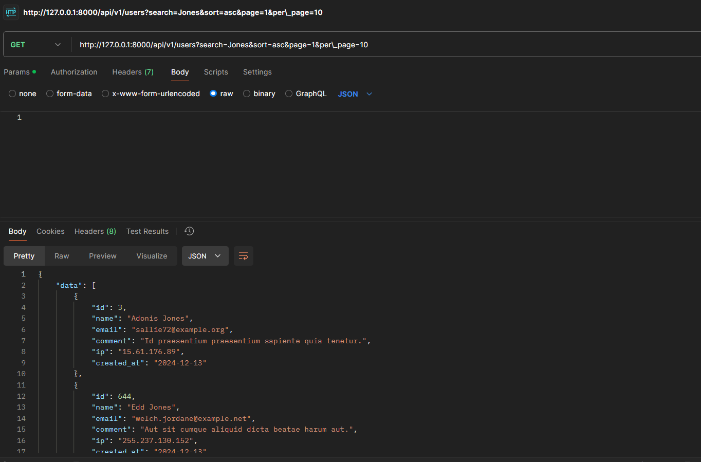
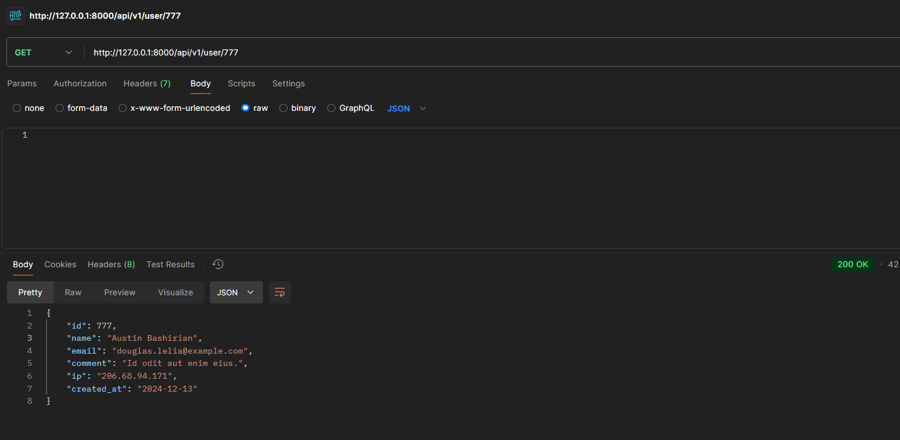
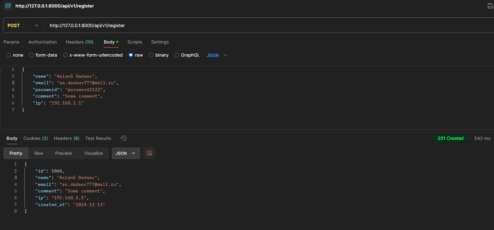
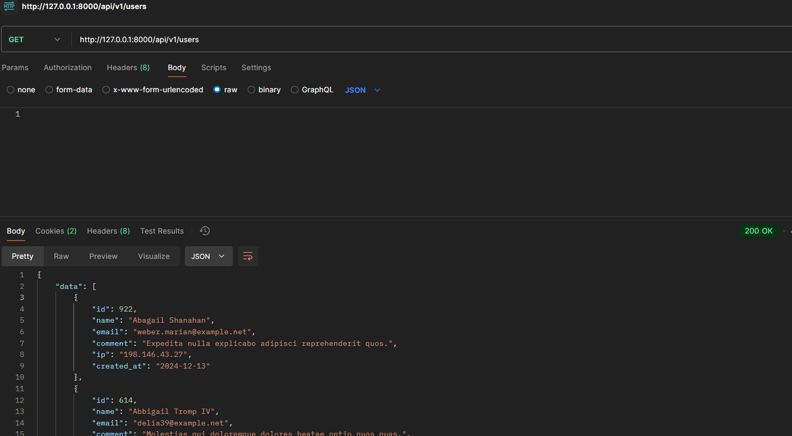
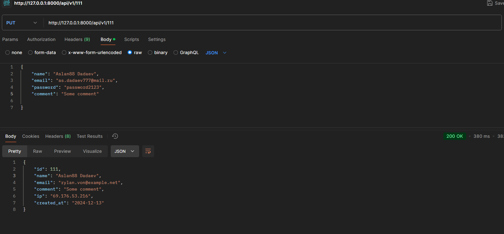
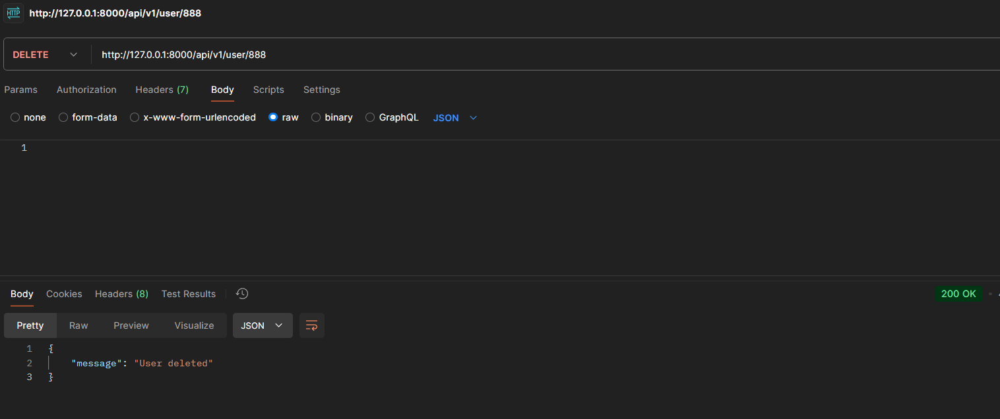

---
{}
---

# Это REST API для управления пользователями. API предоставляет возможности для создания, обновления, удаления, а также получения данных о пользователях с поддержкой пагинации, поиска и сортировки.

### 1\. Установка зависимостей

### После клонирования репозитория установите все зависимости с помощью Composer

### 2\. Отредактируйте файл `.env(копировать не надо, уже в проекте)` и укажите правильные настройки для вашего подключения к базе данных

### 3\. Примените миграции для создания таблиц в базе данных ( php artisan migrate )

### 4\. Для создания тестовых данных запустите сиды ( php artisan db:seed )

## Использование API

API позволяет выполнять следующие операции:

### 1\. Получить список пользователей (с пагинацией, поиском и сортировкой)

**GET** `/api/v1/users`

#### Параметры запроса:

-  `search` (необязательный) -- строка для поиска по имени пользователя.

-  `sort` (необязательный) -- порядок сортировки. Может быть `asc` (по возрастанию) или `desc` (по убыванию). По умолчанию сортировка по имени в порядке возрастания.

-  `page` (необязательный) -- номер страницы для пагинации.

-  `per_page` (необязательный) -- количество пользователей на странице (по умолчанию 10).

**Пример запроса**: GET:  api/v1/users?search=Jones&sort=asc&page=1&per_page=10

### Получить пользователя по ID. GET: api/v1/user/777

### Cоздание пользователя. POST: api/v1/register

### Получить всех пользователей. GET: api/v1/users

### Обновление данных пользователя. PUT: api/v1/111

### Удаление пользователя. DELETE: api/v1/user/888

